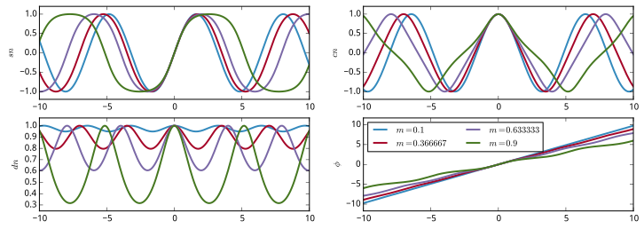

```python
%matplotlib_svg
import numpy as np
import pylab as pl
```

# SciPy-数值计算库


```python
import scipy
scipy.__version__
```


    '0.15.0'


## 常数和特殊函数


```python
from scipy import constants as C
print((C.c)) # 真空中的光速
print((C.h)) # 普朗克常数
```

    299792458.0
    6.62606957e-34


```python
C.physical_constants["electron mass"]
```


    (9.10938291e-31, 'kg', 4e-38)


```python
# 1英里等于多少米, 1英寸等于多少米, 1克等于多少千克, 1磅等于多少千克
%C C.mile; C.inch; C.gram; C.pound
```

          C.mile        C.inch  C.gram        C.pound      
    ------------------  ------  ------  -------------------
    1609.3439999999998  0.0254  0.001   0.45359236999999997


```python
import scipy.special as S
print((S.gamma(4)))
print((S.gamma(0.5)))
print((S.gamma(1+1j))) # gamma函数支持复数
print((S.gamma(1000)))
```

    6.0
    1.77245385091
    (0.498015668118-0.154949828302j)
    inf


```python
S.gammaln(1000)
```


    5905.2204232091808


```python
print((1 + 1e-20))
print((np.log(1+1e-20)))
print((S.log1p(1e-20)))
```

    1.0
    0.0
    1e-20


```python
m = np.linspace(0.1, 0.9, 4)
u = np.linspace(-10, 10, 200)
results = S.ellipj(u[:, None], m[None, :])

print([y.shape for y in results])
```

    [(200, 4), (200, 4), (200, 4), (200, 4)]


```python
#%figonly=使用广播计算得到的`ellipj()`返回值
fig, axes = pl.subplots(2, 2, figsize=(12, 4))
labels = ["$sn$", "$cn$", "$dn$", "$\phi$"]
for ax, y, label in zip(axes.ravel(), results, labels):
    ax.plot(u, y)
    ax.set_ylabel(label)
    ax.margins(0, 0.1)
    
axes[1, 1].legend(["$m={:g}$".format(m_) for m_ in m], loc="best", ncol=2);
```




