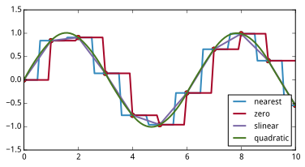
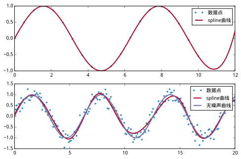
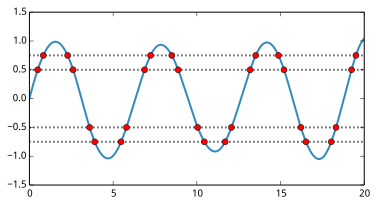
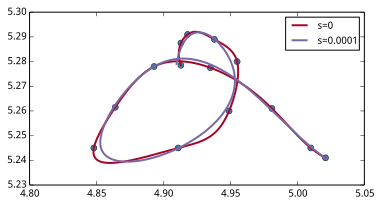
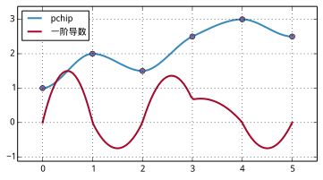
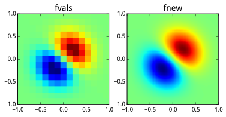
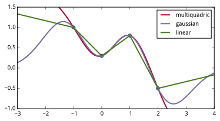
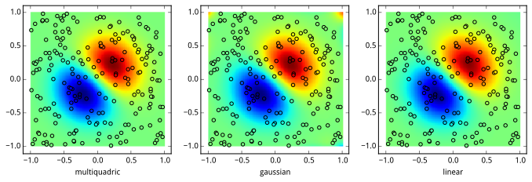
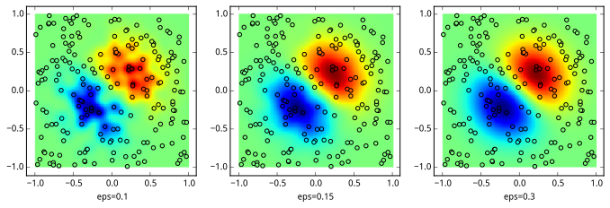

```python
%matplotlib_svg
import numpy as np
import pylab as pl
from scipy import interpolate
```

## 插值-interpolate

### 一维插值

> **WARNING**

> 高次`interp1d()`插值的运算量很大，因此对于点数较多的数据，建议使用后面介绍的`UnivariateSpline()`。


```python
#%fig=`interp1d`的各阶插值
from scipy import interpolate

x = np.linspace(0, 10, 11)
y = np.sin(x)

xnew = np.linspace(0, 10, 101)
pl.plot(x,y,'ro')
for kind in ['nearest', 'zero', 'slinear', 'quadratic']:
    f = interpolate.interp1d(x,y,kind=kind) #❶
    ynew = f(xnew) #❷
    pl.plot(xnew, ynew, label=str(kind))

pl.legend(loc='lower right');
```





#### 外推和Spline拟合


```python
#%fig=使用UnivariateSpline进行插值：外推（上），数据拟合（下）
x1 = np.linspace(0, 10, 20)
y1 = np.sin(x1)
sx1 = np.linspace(0, 12, 100)
sy1 = interpolate.UnivariateSpline(x1, y1, s=0)(sx1) #❶

x2 = np.linspace(0, 20, 200)
y2 = np.sin(x2) + np.random.standard_normal(len(x2))*0.2
sx2 = np.linspace(0, 20, 2000)
spline2 = interpolate.UnivariateSpline(x2, y2, s=8) #❷
sy2 = spline2(sx2) 

pl.figure(figsize=(8, 5))
pl.subplot(211)
pl.plot(x1, y1, ".", label="数据点")
pl.plot(sx1, sy1, label="spline曲线")
pl.legend()

pl.subplot(212)
pl.plot(x2, y2, ".", label="数据点")
pl.plot(sx2, sy2, linewidth=2, label="spline曲线")
pl.plot(x2, np.sin(x2), label="无噪声曲线")
pl.legend();
```





```python
print((np.array_str( spline2.roots(), precision=3 )))
```

    [  3.288   6.329   9.296  12.578  15.75   18.805]


```python
#%fig=计算Spline与水平线的交点
def roots_at(self, v): #❶
    coeff = self.get_coeffs()
    coeff -= v
    try:
        root = self.roots()
        return root
    finally:
        coeff += v

interpolate.UnivariateSpline.roots_at = roots_at #❷

pl.plot(sx2, sy2, linewidth=2, label="spline曲线")

ax = pl.gca()
for level in [0.5, 0.75, -0.5, -0.75]:
    ax.axhline(level, ls=":", color="k")
    xr = spline2.roots_at(level) #❸
    pl.plot(xr, spline2(xr), "ro")
```





#### 参数插值


```python
#%fig=使用参数插值连接二维平面上的点
x = [ 4.913,  4.913,  4.918,  4.938,  4.955,  4.949,  4.911,
      4.848,  4.864,  4.893,  4.935,  4.981,  5.01 ,  5.021]

y = [ 5.2785,  5.2875,  5.291 ,  5.289 ,  5.28  ,  5.26  ,  5.245 ,
      5.245 ,  5.2615,  5.278 ,  5.2775,  5.261 ,  5.245 ,  5.241]

pl.plot(x, y, "o")

for s in (0, 1e-4):
    tck, t = interpolate.splprep([x, y], s=s) #❶
    xi, yi = interpolate.splev(np.linspace(t[0], t[-1], 200), tck) #❷
    pl.plot(xi, yi, lw=2, label="s=%g" % s)
    
pl.legend();
```





#### 单调插值


```python
#%fig=单调插值能保证两个点之间的曲线为单调递增或递减
x = [0, 1, 2, 3, 4, 5]
y = [1, 2, 1.5, 2.5, 3, 2.5]
xs = np.linspace(x[0], x[-1], 100)
curve = interpolate.pchip(x, y)
ys = curve(xs)
dys = curve.derivative(xs)
pl.plot(xs, ys, label="pchip")
pl.plot(xs, dys, label="一阶导数")
pl.plot(x, y, "o")
pl.legend(loc="best")
pl.grid()
pl.margins(0.1, 0.1)
```





### 多维插值


```python
#%fig=使用interp2d类进行二维插值
def func(x, y): #❶
    return (x+y)*np.exp(-5.0*(x**2 + y**2))

# X-Y轴分为15*15的网格
y, x = np.mgrid[-1:1:15j, -1:1:15j] #❷
fvals = func(x, y) # 计算每个网格点上的函数值

# 二维插值
newfunc = interpolate.interp2d(x, y, fvals, kind='cubic') #❸

# 计算100*100的网格上的插值
xnew = np.linspace(-1,1,100)
ynew = np.linspace(-1,1,100)
fnew = newfunc(xnew, ynew) #❹
#%hide
pl.subplot(121)
pl.imshow(fvals, extent=[-1,1,-1,1], cmap=pl.cm.jet, interpolation='nearest', origin="lower")
pl.title("fvals")
pl.subplot(122)
pl.imshow(fnew, extent=[-1,1,-1,1], cmap=pl.cm.jet, interpolation='nearest', origin="lower")
pl.title("fnew")
pl.show()
```





#### griddata

> **WARNING**

> `griddata()`使用欧几里得距离计算插值。如果K维空间中每个维度的取值范围相差较大，则应先将数据正规化，然后使用`griddata()`进行插值运算。


```python
#%fig=使用gridata进行二维插值
# 计算随机N个点的坐标，以及这些点对应的函数值
N = 200
np.random.seed(42)
x = np.random.uniform(-1, 1, N)
y = np.random.uniform(-1, 1, N)
z = func(x, y)

yg, xg = np.mgrid[-1:1:100j, -1:1:100j]
xi = np.c_[xg.ravel(), yg.ravel()]

methods = 'nearest', 'linear', 'cubic'

zgs = [interpolate.griddata((x, y), z, xi, method=method).reshape(100, 100) 
    for method in methods]
#%hide
fig, axes = pl.subplots(1, 3, figsize=(11.5, 3.5))

for ax, method, zg in zip(axes, methods, zgs):
    ax.imshow(zg, extent=[-1,1,-1,1], cmap=pl.cm.jet, interpolation='nearest', origin="lower")
    ax.set_xlabel(method)
    ax.scatter(x, y, c=z)
```


#### 径向基函数插值


```python
#%fig=一维RBF插值
from scipy.interpolate import Rbf

x1 = np.array([-1, 0, 2.0, 1.0])
y1 = np.array([1.0, 0.3, -0.5, 0.8])

funcs = ['multiquadric', 'gaussian', 'linear']
nx = np.linspace(-3, 4, 100)
rbfs = [Rbf(x1, y1, function=fname) for fname in funcs] #❶
rbf_ys = [rbf(nx) for rbf in rbfs] #❷
#%hide
pl.plot(x1, y1, "o")
for fname, ny in zip(funcs, rbf_ys):
    pl.plot(nx, ny, label=fname, lw=2)

pl.ylim(-1.0, 1.5)
pl.legend();
```





```python
for fname, rbf in zip(funcs, rbfs):
    print((fname, rbf.nodes))
```

    multiquadric [ -3.79570791   9.82703701   5.08190777 -11.13103777]
    gaussian [ 1.78016841 -1.83986382 -1.69565607  2.5266374 ]
    linear [-0.26666667  0.6         0.73333333 -0.9       ]


```python
#%fig=二维径向基函数插值
rbfs = [Rbf(x, y, z, function=fname) for fname in funcs]
rbf_zg = [rbf(xg, yg).reshape(xg.shape) for rbf in rbfs]
#%hide
fig, axes = pl.subplots(1, 3, figsize=(11.5, 3.5))
for ax, fname, zg in zip(axes, funcs, rbf_zg):
    ax.imshow(zg, extent=[-1,1,-1,1], cmap=pl.cm.jet, interpolation='nearest', origin="lower")
    ax.set_xlabel(fname)
    ax.scatter(x, y, c=z)
```





```python
#%fig=`epsilon`参数指定径向基函数中数据点的作用范围
epsilons = 0.1, 0.15, 0.3
rbfs = [Rbf(x, y, z, function="gaussian", epsilon=eps) for eps in epsilons]
zgs = [rbf(xg, yg).reshape(xg.shape) for rbf in rbfs]
#%hide
fig, axes = pl.subplots(1, 3, figsize=(11.5, 3.5))
for ax, eps, zg in zip(axes, epsilons, zgs):
    ax.imshow(zg, extent=[-1,1,-1,1], cmap=pl.cm.jet, interpolation='nearest', origin="lower")
    ax.set_xlabel("eps=%g" % eps)
    ax.scatter(x, y, c=z)
```




