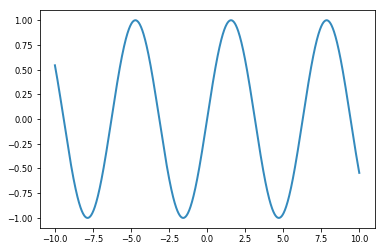
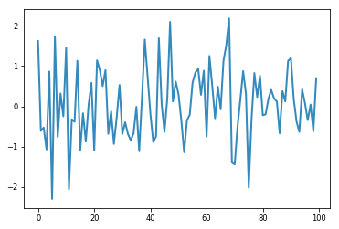
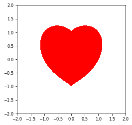

$e^{i\pi}+1 = 0$


```python
import numpy as np
import matplotlib.pyplot as plt
x=np.linspace(-10,10,1000)
y=np.sin(x)
plt.plot(x,y)
plt.show()
%matplotlib inline 
import pylab as pl 
pl.seed(1)
data = pl.randn(100) 
pl.plot(data)
```

    d:\program files\python\lib\site-packages\matplotlib\__init__.py:913: UserWarning: axes.color_cycle is deprecated and replaced with axes.prop_cycle; please use the latter.
      warnings.warn(self.msg_depr % (key, alt_key))
    d:\program files\python\lib\site-packages\matplotlib\font_manager.py:1297: UserWarning: findfont: Font family ['WenQuanYi Micro Hei'] not found. Falling back to DejaVu Sans
      (prop.get_family(), self.defaultFamily[fontext]))





    [<matplotlib.lines.Line2D at 0x24b0caecac8>]


    d:\program files\python\lib\site-packages\matplotlib\font_manager.py:1297: UserWarning: findfont: Font family ['WenQuanYi Micro Hei'] not found. Falling back to DejaVu Sans
      (prop.get_family(), self.defaultFamily[fontext]))





```python
a=[1,2,3]
%timeit a[1]=10
```

    119 ns ± 4.7 ns per loop (mean ± std. dev. of 7 runs, 10000000 loops each)


```python
%%timeit
a=[]
for i in range(10):
    a.append(i)
    
```

    2.59 µs ± 111 ns per loop (mean ± std. dev. of 7 runs, 100000 loops each)


```python
%%time
a=[]
for i in range(10000):
    a.append(i)
    
```

    Wall time: 4 ms


```python
%%capture time_results
import random
for n in [1000,5000,10000,50000]:
    print("n={0}".format(n))
    alist=list(range(n))
    %time random.shuffle(alist)
print(time_results.stderr,time_results.stdout)
```


```python
%%capture time_results
import random
timeit_results=[]
for n in [1000,5000,10000,50000]:
    alist=[random.random() for i in range(n)]
    res = %timeit -o sorted(alist)
    timeit_results.append((n,res))
#print(time_results.stderr,time_results.stdout)
```


```python
%%prun
def fib(n):
    if n<2:
        return 1
    else:
        return fib(n-1)+fib(n-2)
def fib_fast(n,a=1,b=1):
    if n==1:
        return b
    else:
        return fib_fast(n-1,b,a+b)
%time fib(20)
%time fib_fast(20)
```

    Wall time: 17.1 ms
    Wall time: 0 ns
     


```python
import math
def sinc(x):
    return math.sin(x)/x
[sinc(x) for x in range(1,5)]

```


    [0.8414709848078965,
     0.45464871341284085,
     0.0470400026866224,
     -0.18920062382698205]


```python
%debug

```

    > <ipython-input-14-dc428f8d2f58>(3)sinc()
          1 import math
          2 def sinc(x):
    ----> 3     return math.sin(x)/x
          4 [sinc(x) for x in range(5)]
    
    ipdb> p x
    0
    ipdb> q


```python
from IPython import display
for i in range(2,4):
    display.display(display.Latex("$x^{i}+y^{i}$".format(i=i)))
display.Latex("$x^4+y^4$")
```


$x^2+y^2$


$x^3+y^3$


$x^4+y^4$


```python
logurl="https://www.python.org/static/community_logos/python-logo-master-v3-TM.png"
display.Image(url=logurl,embed=True)
```


```python
def as_png(img,**kw):
    import io
    from matplotlib import image
    from IPython import display
    buf=io.BytesIO()
    image.imsave(buf,img,**kw)
    return buf.getvalue()
```


```python
import numpy as np
from matplotlib import image
y,x=np.mgrid[-3:3:300j,-6:6:600j]
z=np.sin(x**2+2*y**2+x*y)
png=as_png(z,cmap="Blues",vmin=-2,vmax=2)
print((repr(png[:10])))
display.Image(png)
```

    b'\x89PNG\r\n\x1a\n\x00\x00'


```python
import os
ipython=get_ipython()
print(("HOME",os.environ["HOME"]))
print(("IPython配置",ipython.ipython_dir))
print(("PWD",ipython.config.ProfileDir.location))
```

    HOME E:\SystemDocuments\文档
    IPython配置 E:\SystemDocuments\文档\.ipython
    PWD <traitlets.config.loader.LazyConfigValue object at 0x0000024B0CAA3400>


```python
#import IPython.html.nbextentions as nb
#ext="https://github.com/ipython-contrib/IPython-notebook-extensions/archive/3.x.zip"
#nb.install_nbextension(ext,user=True)
```


```python
import numpy as np
n=100000
np.sum(4.0/np.r_[1:n:4,-3:-n:-4])
```


    3.1415726535897939


```python
from scipy.integrate import quad
quad(lambda x:(1-x**2)**0.5,-1,1)[0]*2
```


    3.141592653589797


```python
from sympy import symbols,integrate,sqrt
x=symbols("x")
integrate(sqrt(1-x**2),(x,-1,1))*2
```


    pi


```python
x,y=np.mgrid[-2:2:500j,-2:2:500j]
z=(x**2+y**2-1)**3-x**2*y**3
```


```python
pl.contourf(x,y,z,levels=[-1,0],colors=['red'])
pl.gca().set_aspect("equal")
```

    d:\program files\python\lib\site-packages\matplotlib\font_manager.py:1297: UserWarning: findfont: Font family ['WenQuanYi Micro Hei'] not found. Falling back to DejaVu Sans
      (prop.get_family(), self.defaultFamily[fontext]))





```python
%%mlab_plot
print((1))
```

    1


    ---------------------------------------------------------------------------

    IndexError                                Traceback (most recent call last)

    <ipython-input-2-2bac0694666f> in <module>()
    ----> 1 get_ipython().run_cell_magic('mlab_plot', '', 'print(1)')
    

    d:\program files\python\lib\site-packages\IPython\core\interactiveshell.py in run_cell_magic(self, magic_name, line, cell)
       2101             magic_arg_s = self.var_expand(line, stack_depth)
       2102             with self.builtin_trap:
    -> 2103                 result = fn(magic_arg_s, cell)
       2104             return result
       2105 


    <decorator-gen-171> in mlab_plot(self, line, cell)


    d:\program files\python\lib\site-packages\IPython\core\magic.py in <lambda>(f, *a, **k)
        185     # but it's overkill for just that one bit of state.
        186     def magic_deco(arg):
    --> 187         call = lambda f, *a, **k: f(*a, **k)
        188 
        189         if callable(arg):


    E:\Study\Computer\编程类\Python\数据分析与科学计算\Python科学计算\notebooks\scpy2\utils\nbmagics.py in mlab_plot(self, line, cell)
        323                 ip.run_cell(cell)
        324                 from scpy2 import vtk_scene_to_array
    --> 325                 img = vtk_scene_to_array(scene.scene)
        326                 return show_arrays([img])
        327             finally:


    E:\Study\Computer\编程类\Python\数据分析与科学计算\Python科学计算\notebooks\scpy2\tvtk\tvtkhelp.py in vtk_scene_to_array(scene, close)
         42     arr = arr[::-1].copy()
         43     mask = np.all(arr == arr[0, 0], -1)
    ---> 44     x0, x1 = np.where(~np.all(mask, axis=0))[0][[0, -1]]
         45     y0, y1 = np.where(~np.all(mask, axis=1))[0][[0, -1]]
         46     if close:


    IndexError: index 0 is out of bounds for axis 0 with size 0


```python
#import pandas as pd
#columns='user_id','age','sex','occupation','zip_code'
#df=pd.read_csv()
import vtk
import traits
import mayavi
```


```python

```
